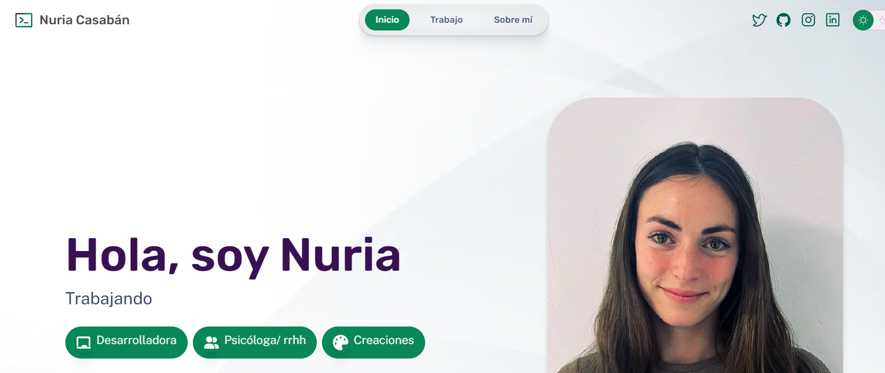

# Objetivo del Portfolio
Mi objetvo era aprender a usar Astro realizando un ejemplo de mi portfolio personal.
No todo lo que hay en el portfolio es mentira pero tampoco es todo cierto ya que lo he basado en mi idea como meta que me gustaría poder llega a saber. 

> 🧑 **** 
En el navegador superior de manera fija: iconos que te llevan a mi perfil en diferentes redes sociales, abriendose una pestaña nueva.
En la parte inferior del portofolio el enlace para contactar conmigo por correo electrónico.
Las imagenes han sido cambiadas de formato a formato webp.
El fondo claro ha sido modificado con una imagen.
Los colores tanto en fondo claro (predomida el verde) como en fondo oscuro (predomina el rosa)

## Partes del portfolio
> Inicio: 
   - Cualidades/ Atributos 
   - Imagen formal personal
   - Visualización de todos mis 'trabajos'
   - Enumeración de formaciones sobre temas generales
   - Mi email para contactarme (que aparece en todas las páginas)

> Trabajos
    - Visualización de 4 'trabajos' (inventados). He intentado cambiar un poco la estructura de cada uno de ellos, en alguno poner títulos, en otro poner links a alguna palabra mencionada...
> Sobre mí
    - Cambiada la estructura inicial de presentación sobre mí. Añadida foto más informal.

## Quieres saber más? Aquí va la captura del principio de la página inicial:

